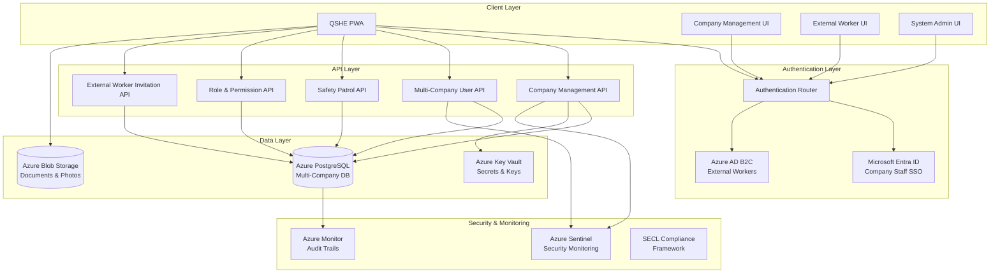
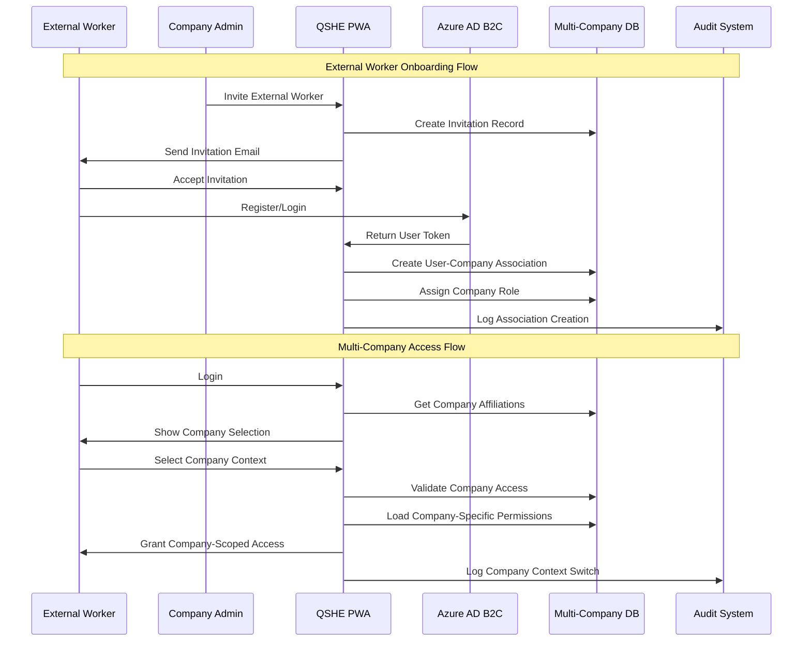

# QSHE PWA - Multi-Company Architecture & File Structure

## 🏗️ **Enhanced Multi-Company PWA Architecture**

### **High-Level System Architecture**



### **Multi-Company Data Flow Architecture**



## 📁 **Enhanced File Structure**

```
qshe/
├── 📁 docs/                                    # Documentation
│   ├── 📄 azure_migration_plan.md             # Updated migration plan
│   ├── 📄 multi_company_architecture.md       # This file
│   ├── 📁 companyRequirements/
│   │   ├── 📄 SECL_Security_Compliance_Table.md
│   │   ├── 📄 Multi-factor_authentication.md
│   │   └── 📄 azure-ad-b2c-multicompany-config.md
│   └── 📁 api/
│       ├── 📄 multi_company_api_spec.md
│       └── 📄 external_worker_api.md
│
├── 📁 src/                                     # Application Source
│   ├── 📁 components/                          # React Components
│   │   ├── 📁 auth/                           # Authentication Components
│   │   │   ├── 📄 CompanyLoginForm.tsx        # Company SSO login
│   │   │   ├── 📄 ExternalWorkerLogin.tsx     # B2C external login
│   │   │   ├── 📄 CompanySelector.tsx         # Multi-company selection
│   │   │   └── 📄 AuthGuard.tsx               # Multi-company auth guard
│   │   │
│   │   ├── 📁 company/                        # Company Management
│   │   │   ├── 📄 CompanyDashboard.tsx        # Company overview
│   │   │   ├── 📄 ExternalWorkerManager.tsx   # Manage external workers
│   │   │   ├── 📄 InviteWorkerForm.tsx        # Send invitations
│   │   │   ├── 📄 RoleAssignmentPanel.tsx     # Assign/modify roles
│   │   │   └── 📄 CompanyMembersList.tsx      # View all members
│   │   │
│   │   ├── 📁 external/                       # External Worker Features
│   │   │   ├── 📄 WorkerProfile.tsx           # External worker profile
│   │   │   ├── 📄 CompanyAffiliations.tsx     # Multiple company views
│   │   │   ├── 📄 DocumentVerification.tsx    # Upload docs (no face scan)
│   │   │   └── 📄 InvitationAcceptance.tsx    # Accept company invites
│   │   │
│   │   ├── 📁 common/                         # Shared Components
│   │   │   ├── 📄 RoleGuard.tsx               # Enhanced role-based guards
│   │   │   ├── 📄 PermissionChecker.tsx       # Multi-company permissions
│   │   │   ├── 📄 CompanyContextProvider.tsx  # Company context management
│   │   │   └── 📄 MultiCompanyLayout.tsx      # Layout with company switcher
│   │   │
│   │   ├── 📁 patrol/                         # Safety Patrol (existing)
│   │   ├── 📁 projects/                       # Project Management
│   │   └── 📁 admin/                          # System Administration
│   │
│   ├── 📁 hooks/                              # Custom React Hooks
│   │   ├── 📄 useMultiCompanyAuth.ts          # Multi-company auth hook
│   │   ├── 📄 usePermissionCheck.ts           # Permission checking
│   │   ├── 📄 useRoleManagement.ts            # Role operations
│   │   ├── 📄 useExternalWorkerInvitation.ts  # Invitation management
│   │   ├── 📄 useCompanyMembers.ts            # Company member management
│   │   └── 📄 useCompanyContext.ts            # Company context switching
│   │
│   ├── 📁 services/                           # API Services
│   │   ├── 📁 auth/                           # Authentication Services
│   │   │   ├── 📄 entraIdService.ts           # Company SSO service
│   │   │   ├── 📄 b2cService.ts               # External worker B2C
│   │   │   └── 📄 authRouter.ts               # Route auth requests
│   │   │
│   │   ├── 📁 company/                        # Company Management Services
│   │   │   ├── 📄 companyService.ts           # Company CRUD operations
│   │   │   ├── 📄 memberService.ts            # Member management
│   │   │   ├── 📄 invitationService.ts        # External worker invitations
│   │   │   └── 📄 roleService.ts              # Role and permission service
│   │   │
│   │   ├── 📁 external/                       # External Worker Services
│   │   │   ├── 📄 externalWorkerService.ts    # External worker operations
│   │   │   ├── 📄 verificationService.ts      # Document verification (no face)
│   │   │   └── 📄 affiliationService.ts       # Multi-company affiliations
│   │   │
│   │   └── 📄 supabaseClient.ts               # Enhanced Supabase client
│   │
│   ├── 📁 types/                              # TypeScript Types
│   │   ├── 📄 multiCompanyRoles.ts            # Multi-company type definitions
│   │   ├── 📄 externalWorker.ts               # External worker types
│   │   ├── 📄 companyManagement.ts            # Company management types
│   │   ├── 📄 auth.ts                         # Enhanced auth types
│   │   └── 📄 database.ts                     # Database schema types
│   │
│   ├── 📁 store/                              # Redux Store
│   │   ├── 📄 authSlice.ts                    # Enhanced auth state
│   │   ├── 📄 companySlice.ts                 # Company context state
│   │   ├── 📄 roleSlice.ts                    # Role and permission state
│   │   └── 📄 externalWorkerSlice.ts          # External worker state
│   │
│   ├── 📁 utils/                              # Utility Functions
│   │   ├── 📄 permissions.ts                  # Permission checking utilities
│   │   ├── 📄 roleHelpers.ts                  # Role management helpers
│   │   ├── 📄 companyUtils.ts                 # Company-related utilities
│   │   └── 📄 documentValidation.ts           # Document verification (no face)
│   │
│   └── 📁 lib/                                # External Libraries
│       ├── 📄 supabase.ts                     # Enhanced Supabase config
│       ├── 📄 azure-auth.ts                   # Azure authentication config
│       └── 📄 permissions.ts                  # Permission definitions
│
├── 📁 database/                               # Database Scripts
│   ├── 📄 migrate_user_company_many_to_many.sql
│   ├── 📄 create_multicompany_rbac_system.sql
│   ├── 📄 external_worker_invitations.sql
│   ├── 📄 company_roles_permissions.sql
│   └── 📄 remove_face_recognition.sql
│
├── 📁 public/                                 # Static Assets
│   ├── 📁 icons/                              # App icons
│   ├── 📁 docs/                               # User documentation
│   │   ├── 📄 external_worker_guide.pdf
│   │   ├── 📄 company_admin_manual.pdf
│   │   └── 📄 multi_company_user_guide.pdf
│   └── 📄 manifest.json                       # PWA manifest
│
├── 📁 tests/                                  # Test Files
│   ├── 📁 components/
│   │   ├── 📄 CompanySelector.test.tsx
│   │   ├── 📄 ExternalWorkerManager.test.tsx
│   │   └── 📄 RoleAssignmentPanel.test.tsx
│   ├── 📁 hooks/
│   │   ├── 📄 useMultiCompanyAuth.test.ts
│   │   └── 📄 usePermissionCheck.test.ts
│   ├── 📁 services/
│   │   ├── 📄 companyService.test.ts
│   │   └── 📄 invitationService.test.ts
│   └── 📁 integration/
│       ├── 📄 multiCompanyFlow.test.ts
│       └── 📄 externalWorkerOnboarding.test.ts
│
├── 📁 scripts/                                # Build & Deployment Scripts
│   ├── 📄 migrate-to-azure.sh
│   ├── 📄 setup-multicompany.sh
│   └── 📄 deploy-b2c-config.sh
│
├── 📄 package.json                            # Dependencies
├── 📄 vite.config.ts                          # Vite configuration
├── 📄 tailwind.config.js                      # Tailwind CSS
├── 📄 tsconfig.json                           # TypeScript config
└── 📄 README.md                               # Project documentation
```

## 🔄 **Data Flow Patterns**

### **1. Multi-Company Authentication Flow**
```typescript
// Enhanced authentication flow
const authenticateUser = async (userType: 'company' | 'external') => {
  if (userType === 'company') {
    // Microsoft Entra ID SSO
    const result = await msalInstance.loginPopup(companyAuthRequest);
    return processCompanyUser(result);
  } else {
    // Azure AD B2C
    const result = await b2cInstance.loginPopup(b2cAuthRequest);
    return processExternalWorker(result);
  }
};

const processExternalWorker = async (authResult: any) => {
  // Get user's company affiliations
  const companies = await getUserCompanies(authResult.account.localAccountId);
  
  if (companies.length > 1) {
    // Show company selection
    const selectedCompany = await showCompanySelector(companies);
    await setCompanyContext(selectedCompany.id);
  }
  
  return createUserSession(authResult, companies);
};
```

### **2. Company Context Management**
```typescript
// Company context switching
const CompanyContextProvider = ({ children }: { children: React.ReactNode }) => {
  const [currentCompany, setCurrentCompany] = useState<CompanyContext | null>(null);
  const [userPermissions, setUserPermissions] = useState<string[]>([]);
  
  const switchCompany = async (companyId: string) => {
    // Validate user access to company
    const hasAccess = await validateCompanyAccess(user.id, companyId);
    if (!hasAccess) throw new Error('Access denied');
    
    // Load company-specific permissions
    const permissions = await getUserPermissions(user.id, companyId);
    
    // Update context
    setCurrentCompany({ id: companyId, permissions });
    setUserPermissions(permissions);
    
    // Audit log
    await logCompanyContextSwitch(user.id, companyId);
  };
  
  return (
    <CompanyContext.Provider value={{ currentCompany, switchCompany }}>
      {children}
    </CompanyContext.Provider>
  );
};
```

### **3. Permission-Based Access Control**
```typescript
// Enhanced permission checking
const usePermission = (permission: string, companyId?: string) => {
  const { currentCompany } = useCompanyContext();
  const { user } = useAuth();
  
  return useMemo(() => {
    // System admins have all permissions
    if (user?.role === 'system_admin') return true;
    
    // Check company-specific permissions
    const targetCompanyId = companyId || currentCompany?.id;
    if (!targetCompanyId) return false;
    
    return currentCompany?.permissions.includes(permission) || false;
  }, [permission, companyId, currentCompany, user]);
};

// Permission-based component rendering
const PermissionGuard = ({ 
  permission, 
  companyId, 
  children, 
  fallback 
}: PermissionGuardProps) => {
  const hasPermission = usePermission(permission, companyId);
  
  if (!hasPermission) {
    return fallback || <AccessDenied permission={permission} />;
  }
  
  return <>{children}</>;
};
```

## 🔧 **Configuration & Environment**

### **Multi-Company Environment Variables**
```typescript
// Enhanced environment configuration
interface MultiCompanyConfig {
  // Azure Authentication
  azure: {
    company: {
      clientId: string;
      tenantId: string;
      authority: string;
    };
    b2c: {
      clientId: string;
      tenantName: string;
      signInPolicy: string;
      editProfilePolicy: string;
    };
  };
  
  // Database
  database: {
    url: string;
    enableMultiCompany: boolean;
    enableAuditLogging: boolean;
  };
  
  // Features
  features: {
    externalWorkers: boolean;
    companyInvitations: boolean;
    documentVerification: boolean;
    faceRecognition: false; // Permanently disabled
  };
  
  // Security
  security: {
    sessionTimeout: number;
    companyContextTimeout: number;
    requireDocumentVerification: boolean;
  };
}
```

## 📊 **Database Schema Overview**

```sql
-- Key tables for multi-company architecture
TABLE users (
  id uuid PRIMARY KEY,
  email varchar UNIQUE,
  first_name varchar,
  last_name varchar,
  user_type user_type_enum, -- 'internal' | 'external'
  worker_type varchar, -- 'contractor' | 'consultant' | 'temporary' | 'visitor'
  verification_status varchar, -- 'unverified' | 'pending' | 'verified'
  primary_company_id uuid, -- Default company context
  -- face_descriptors REMOVED
);

TABLE user_company_associations (
  id uuid PRIMARY KEY,
  user_id uuid REFERENCES users(id),
  company_id uuid REFERENCES companies(id),
  company_role_id uuid REFERENCES company_roles(id),
  status varchar, -- 'active' | 'inactive' | 'pending'
  approval_status varchar, -- 'pending' | 'approved' | 'rejected'
  start_date date,
  end_date date
);

TABLE company_roles (
  id uuid PRIMARY KEY,
  company_id uuid REFERENCES companies(id),
  role_name varchar, -- 'company_admin' | 'project_manager' | 'external_worker'
  permissions jsonb -- Array of permission keys
);

TABLE permissions (
  id uuid PRIMARY KEY,
  permission_key varchar UNIQUE, -- 'patrol.create' | 'user.manage_roles'
  permission_name varchar,
  category varchar, -- 'patrol' | 'user' | 'company' | 'project'
  is_sensitive boolean
);
```

This enhanced architecture supports the multi-company requirements while completely removing face recognition dependencies, providing a scalable, secure, and compliant QSHE PWA system.